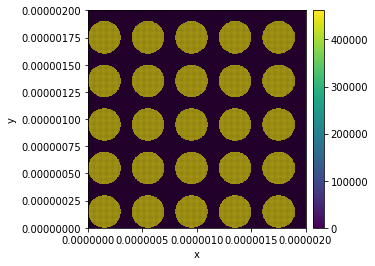

```python
import oommfc as oc
import discretisedfield as df
import numpy as np
```


```python
L = 2000e-9  # mesh edge length (m)
L1 = 30e-9 
d = 5e-9  # discretisation cell (m)
mesh = oc.Mesh(p1=(0, 0, 0), p2=(L, L, L1), cell=(d, d, d))
```


```python
%matplotlib inline
mesh
```


```python
#System object
system = oc.System(name="paper-4")

# Hamiltonian
A = 13e-12  # exchange energy constant (J/m)
H =73210.84* np.array([0.81345856316858023, 0.58162287266553481, 0.0])# external magnetic field (A/m)
system.hamiltonian =  oc.Exchange(A) +oc.Demag() + oc.Zeeman(H)


# Dynamics
gamma = 2.211e5 # gyromagnetic ratio (m/As)
alpha = 0.008  # Gilbert damping
system.dynamics = oc.Precession(gamma) + oc.Damping(alpha)
```


```python
import math

import math as math
import itertools as it

def Ms_function2 (pos):
    def hdistance(p1,p2):
        x1,y1,z1 = p1
        x2,y2,z2 = p2
        return math.sqrt((x2 - x1)**2 + (y2 - y1)**2)
    p3 = list(range(150,3000,400))
    p4 = [i * 1e-9 for i in p3]
    p5 = list(it.product(p4,p4,[0]))
    for pt in p5:
        if hdistance(pos,pt) <= 150e-9:
            return 8e5
    else:
            return 0
```


```python
system.m = df.Field(mesh, value=(1,1,1), norm=Ms_function2 ) 
```


```python
system.m.plot_plane("z")
system.m.plot_plane("x")
```





```python
md = oc.MinDriver()
md.drive(system)
```

    2018/10/17 13:39: Running OOMMF (paper-4\paper-4.mif) ... (54.6 s)
    


```python
system.m.plot_plane("z")
```


```python
# Change external magnetic field.
H =73210.84* np.array([0.81923192051904048, 0.57346234436332832, 0.0]) # external magnetic field (A/m)
system.hamiltonian.zeeman.H = H
```


```python
T =5e-9
n =500

td = oc.TimeDriver()
td.drive(system, t=T, n=n)
```

    2018/10/17 13:40: Running OOMMF (paper-4\paper-4.mif) ... (5397.1 s)
    


```python
import matplotlib.pyplot as plt

t = system.dt['t'].as_matrix()
my = system.dt['my'].as_matrix()

# Plot <my> time evolution.
plt.figure(figsize=(8, 6))
plt.plot(t, my)
#plt.xlim([1e-9, 1.75e-9])
plt.xlabel('t (ns)')
plt.ylabel('my average')
plt.grid()
```

    D:\anaconda\lib\site-packages\ipykernel_launcher.py:3: FutureWarning: Method .as_matrix will be removed in a future version. Use .values instead.
      This is separate from the ipykernel package so we can avoid doing imports until
    D:\anaconda\lib\site-packages\ipykernel_launcher.py:4: FutureWarning: Method .as_matrix will be removed in a future version. Use .values instead.
      after removing the cwd from sys.path.
    


```python
import scipy.fftpack


psd = np.log10(np.abs(scipy.fftpack.fft(my))**2)
f_axis = scipy.fftpack.fftfreq(n, d=T/n)

plt.plot(f_axis/1e9, psd)
plt.xlim([0,12])
plt.xlabel('f (GHz)')
plt.ylabel('Psa (a.u.)')
plt.grid()
```


